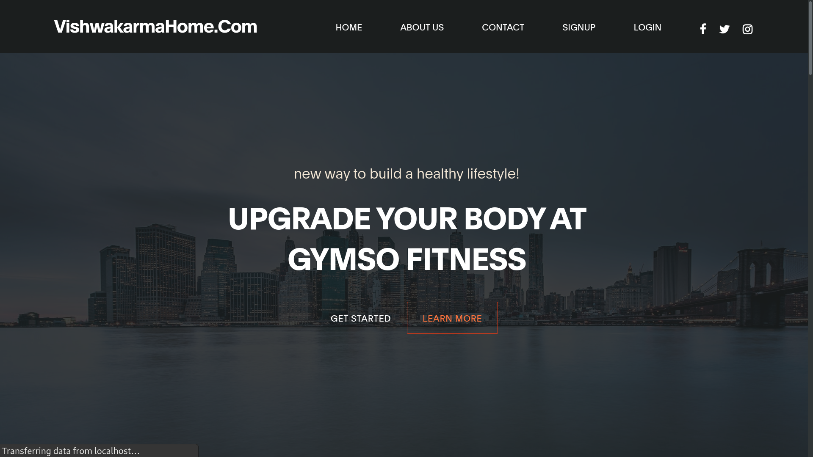
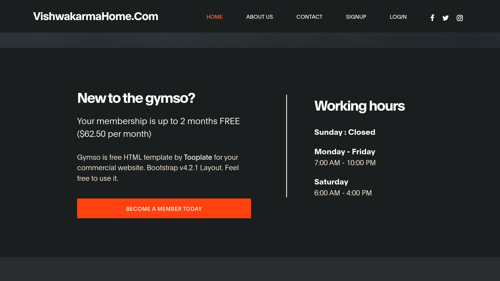

  

<!-- PROJECT LOGO -->
 

  
  
  <h3 align="center"><b>GymWebsiteReact</b></h3>

  

    This website is for Gyms with gym flavours and theme   which is fully functional and fast as it is based on ReactJS..
     
    <a href="#"><strong>Explore the docs »</strong></a>
     
     
    <a href="https://github.com/othneildrew/Best-README-Template">View Demo</a>
    ·
    <a href="https://github.com/shivam92211/GymWebsiteReact/issues">Report Bug</a>
    ·
    <a href="https://github.com/shivam92211/GymWebsiteReact/issues">Request Feature</a>
  

<!-- ABOUT THE PROJECT -->

## ☑️ About The Project

**Gym Website React** 

When we look back on the evolution of the fitness industry in India, it is fascinating to see how the demand for fitness products and services has grown by leaps and bounds over the last decade. The inflection point that the sector is currently at, points towards a lot of positive developments in the future. The advent of technology and the democratization of information has been one of the many crucial factors that have led to the surge in consumers taking a greater interest in fitness and actively seeking products and services to help them remain fit. 
Most products and services in the market today are geared towards providing consumers with new and exciting ways to maintain good health and well-being. While many of these people visit gyms and fitness clubs to get in better shape or gain more strength, those with the want to become more fit and lead more active lifestyles having a no better option. A combination of physical, mental, and spiritual fitness is a must for the urban population. The fitness industry in India is largely unorganized and lacks a definite structure to differentiate between diverse product and service segments. Until a few years ago, the fitness industry was dominated by a handful of large players, be it in terms of gyms and fitness centers or even fitness equipment. But this situation is changing gradually with the entry of new small players in the market, who are leveraging technology to create and deliver services and products. 

India is a story of a growing middle class. With millions joining the workforce every year competing to sustain their careers, there is a compromise made unknowingly. Increasing physical inactivity, had diets, and falling health get ignored to survive the rigour of the work-life. Frenetic work schedules, extensive travel, awry sleep patterns, and diets bursting with trans fats have only made us more prone to serious health disorders than ever before. Lifestyle diseases are becoming endemic to our society and almost always, the solution begins with getting off your couch and making simple lifestyle changes. 
The number of overweight and obese people in India doubled in the last decade. India stands at 65 million obese citizens and this number is increasing at a very high rate every year. Diabetes develops in adults due to poor eating habits and bad lifestyle choices. India has the largest number of diabetics (72 Million) with type II at 50 million. At least 150 million people in the country, affected by mental disorders, require active medical intervention. Lack of social support, changing diets and economic instability are the main triggers of mental disorders. 26 percent of all deaths in India happen due to cardiovascular diseases. Small studies suggest that one in 10 adults suffers from hypothyroidism. Hormonal balance is very delicate and is easily disturbed by exposure to toxins, air pollution, and even food rich in fats, sugar, and salt. Globally, 14.2 million people between the ages of 30-69 years, die prematurely each year from diseases like heart attack, diabetes, and high blood pressure. 

This project is developed by [me](https://github.com/shivam92211)

## ⚙️ Installation 

Installation is very easy.

1 : Just clone this project.
2 : Go to the project directory in the terminal
3 : Run the command `npm install` then `npm audit fix` and lastly `npm audit fix --force`
4 : Now run `npm start`

The above commands will start the develpment server on your machine.

**First :** `npm install`

**Then :** `npm audit fix --force`

**Finally :** `npm start`

(<a href="#top">back to top</a>)

## 📖 License 

  [MIT](https://github.com/shivam92211/GymWebsiteReact/blob/main/LICENSE)
